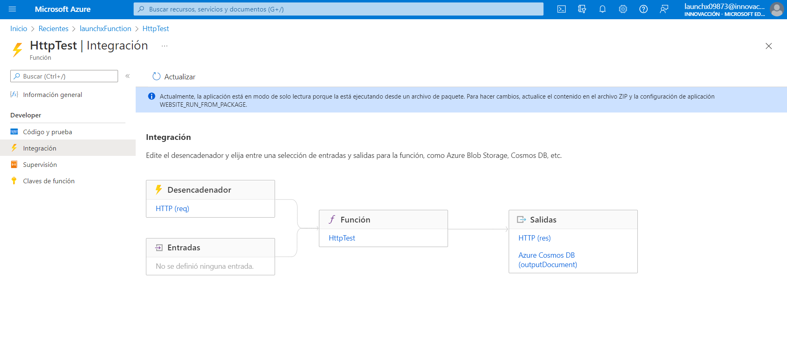

# FUNCIONES DE AZURE

En este apartado vamos a describir como se realizó la generación de la función, así como su despliegue en Azure, para ello vamos a apoyarnos de **VISUAL STUDIO CODE**.

### Requerimientos
- Cuenta de Azure
- Node en su versión 14 o superior
- Visual Studio Code 
- Azure Function Core Tool 

### INSTRUCCIONES ###

Como primer paso debemos de abrir el visual studio code, una vez instalado debemos de ir al apartado de extensiones y una vez ahí procedemos a buscar la extensión de **Azure Tools** y una vez instalada podemos proseguir.

**Cabe mencionar que para la función se utilizara como lenguaje JavaScript una vez realizada esa aclaración podemos proseguir.**

Primero debemos de dar clic en el icono de Azure que se encuentra del lado izquierdo del editor de visual studio code una vez ahí buscaremos y daremos clic **Functions** o **Funciones**, posteriormente una vez seleccionado procederemos a crear un nuevo proyecto dando clic en el icono de la carpeta con un rayo, al dar clic el botón antes mencionado el editor nos solicitara la ruta donde vamos a trabajar para la cual queda a libertad de elección.

Una vez seleccionada la ruta, el editor nos mostrará una ventana en la cual nos pedirá que seleccionemos el lenguaje que vamos a utilizar para la codificación de las funciones y tal y como se mencionó anteriormente se debe de seleccionar como lenguaje **JavaScript**.

Una vez seleccionada esta opción nos muestra otra ventana en la cual se debe de seleccionar la plantilla con la cual va a trabajar nuestra función, para ello seleccionaremos HTTP Trigger.

Una vez seleccionado se debe de asignar un nombre a la función, para este caso la llamaremos HttpTest pero puede ser llamada como uno guste.

Una vez completado ese paso nos pedirá el Nivel de autorización, para este caso seleccionaremos la opción de Anonymous, esto nos permitirá que cualquiera pueda realizar el llamado a nuestra función; para fines de aprendizaje se recomienda utilizar esta opción pero dentro de un desarrollo para producción se recomienda utilizar el sistema de claves de autorización.

Una vez seleccionada la opción anterior procedemos a añadir el proyecto a un área de trabajo o workspace.

**Con todos estos pasos podemos resumir que lo que se esta haciendo es generar un entorno de trabajo el cual contendrá nuestra función y dicha función va a ser desencadenada o ejecutada mediante una petición HTTP**

## Probar la ejecución en entorno local 

Una vez generada la función podemos realizar la prueba de su funcionamiento ya trae una función generada en automático, para realizar la prueba basta con que presionemos F5 esto nos ejecutara la función de manera local y nos proporciona la opción de debugger de la función.

Al presionar F5 nos abrirá en la parte inferior de visual studio code la terminal en donde nos muestra cual es la ruta con la cual puede ser llamada la función.

Una vez que nos muestra la ruta procedemos a ejecutar la función para ello en el apartado de funciones, seleccionamos el proyecto local y dentro del proyecto local veremos las funciones, damos clic sobre funciones y nos desplegara las funciones que tiene generadas para este caso solo nos muestra la función HttpTets que fue el nombre que le fue asignado anteriormente, la seleccionamos y damos clic derecho y nos muestra un menú, en dicho menú seleccionamos la opción de ejecutar función ahora.

Una vez que seleccionemos esta opción el editor nos muestra un cuadro de dialogo en el cual nos solicita la información que requiere; los datos deben de ser ingresados en formato JSON tal y como los muestra el cuadro de dialogo como ejemplo; una vez completada la información procedemos a dar enter y nos posteriormente no muestra la respuesta de nuestra petición.

Con esto ya se tendría generada una función que va a poder ser llamada mediante HTTP, cabe mencionar que dicha función por el momento solo funcionara en nuestros entornos locales.

Para poder realizar el despliegue en azure solo bastaría con dar clic en la nueve y listo, cabe mencionar que para ello se debe de estar con la sesión iniciada, de igual manara al realizar esto hasta este punto lo que subirá será la función que nos generó en automático, para cualquier otra funcionalidad bastaría con modificar el archivo **index.js** que para este caso la modificación realizada la encontramos [aquí](./HttpTest/index.js).

Del mismo modo esta función ya viene preparada para realizar la inserción en una base de datos de Cosmos mismo servicio que proporciona Microsoft.

## Conexión con Cosmos DB

Para este punto basta con generar una base de datos en Azure para ello nos apoyaremos de visual Code con la extensión antes instalada.

Para ello damos clic en el icono de azure, posteriormente damos clic en la pesatña de base de datos, seleccionamos la suscripción que tenemos damos clic derecho y crear un servidor,
Una vez dando clic en la opción procedemos a seleccionar la siguientes opciones en el cuadro de dialogo que nos aparecerá.
Primero nos preguntara la base de datos que deseamos utilizar, para esta opción seleccionamos core (sql).
Posteriormente colocamos el nombre de la cuenta para este punto podemos colocar el nombre que uno desee.
Posterior a esto procedemos a seleccionar el modelo de capacidad para la cual seleccionaremos la opción de serverless, después procedemos a seleccionar el recurso que generamos anteriormente y finalizamos seleccionando la ubicación de los recursos.

### Creación del contenedor y la base de datos

Seleccionamos la cuenta que se generó y procedemos a dar clic derecho y seleccionamos Crear base de datos, esto nos pedirá primero el nombre de la base y posteriormente el nombre de la colección y finalmente la clave de partición para ello solo debemos de colocar los datos solicitados a libre elección.

## RUTA DEL API DEPLEGADA EN AZURE
https://launchxfunction.azurewebsites.net/api/HttpTest

    JSON DE ENTRADA 

    {
    "NOMBRE":"Francisco Daniel",
    "APELLIDO_PATERNO":"Hernandez",
    "APELLIDO_MATERNO":"Rodrigez",
    "FECHA_DE_NACIMIENTO":"1493-09-28",
    "GENERO":"MASCULINO",
    "CORREO_ELECTRONICO":"PRUEB@PRUEBA.COM",
    "NOMBRE_USUARIO":"Paco",
    }

- [IR A FRONTEND](../../Frontend/README.md)
- [IR A BACKEND](../../Backend/README.md)
- [IR AL ANALISIS DE DATOS](../../AnalisisDatos/README.md)
- [REGREASAR A REPOSITORIO PRINCIPAL](../../README.md)