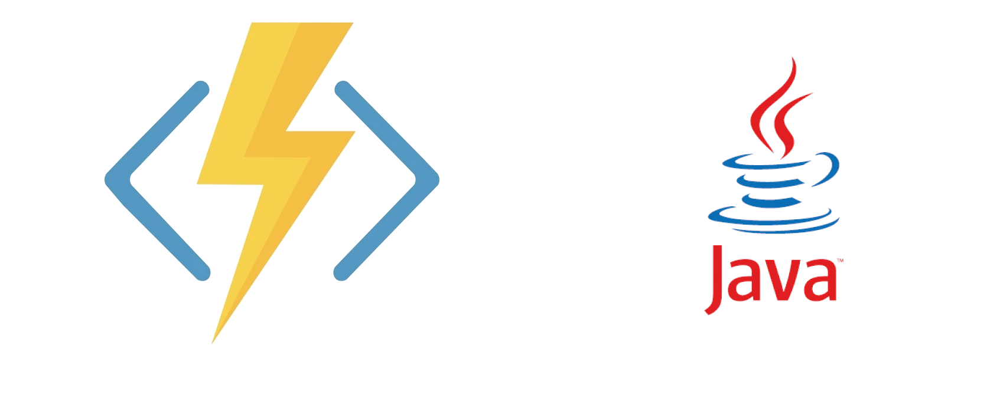

# DESARROLLLO DEL BACKEND 

En este apartado del repositorio se muestra cómo se realiza la implementación del backend con las tecnologías antes mencionadas, cabe mencionar que para este punto del repositorio podemos encontrar la parte de la implementación de funciones en Azure y por otro lado podremos encontrar la parte del backend realizada con JAVA.

## Detalles de la implementación
- Azure Function (JavaScript)
- JAVA

 

- [IR A FRONTEND](../Frontend/README.md)
- [IR AL ANALISIS DE DATOS](../AnalisisDatos/README.md)
- [REGREASAR A REPOSITORIO PRINCIPAL](../README.md)