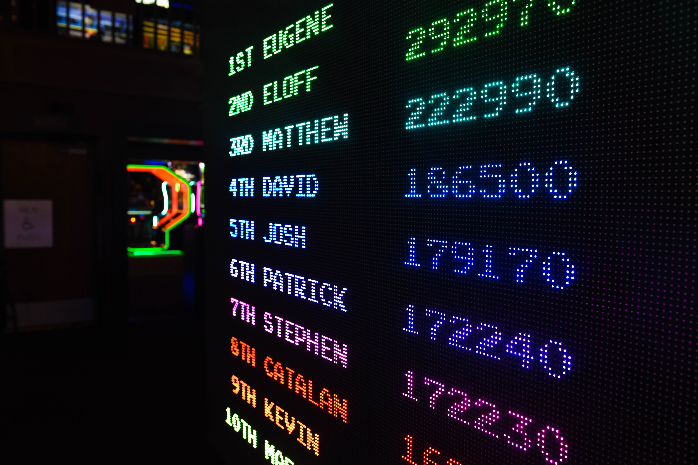
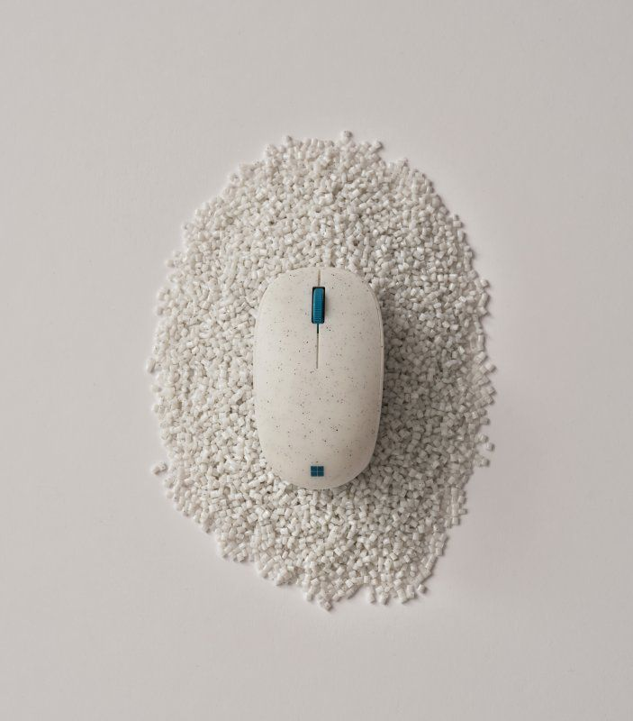

# HackTheOcean Hackaton LaunchX

### Objetivo 
El objetivo del Hackaton de LaunchX es aplicar los conocimientos adquiridos durante el proceso de formación cursado, para ello se nos planteó una problemática la cual se centra en el ecosistema marino, de tal manera que se busca centrarnos en alguna problemática y de igual manera se busca generar una propuesta para solución a dicha problemática.

A continuación, se va a detallas la problemática detecta y la solución que este equipo está proponiendo.

## Problemática Principal
Contaminación por desechos humanos.

En realidad la contaminación del agua es un tema del que urge concientizar ya que de manera conciente o inconciente muchos de nosotros provocamos este problema.

## Propuesta de Solución
Así como el ser huma es la causa principal de igual manera podría ser la solución a dicha situación, el objetivo sería concientizar a las personas y hacer que se involucren en la descontaminación de dicho ecosistema, para ello se plantea lo siguiente:

Se Propone implementar una solución basada en un videojuego el cual nos proporcionara una serie de recompensas, esto con la finalidad de logar captar a la mayor cantidad de jóvenes y adultos, teniendo como objetivo incentivar la limpieza de los ecosistemas marinos.

### Explicación del método del juego:
El jugador podrá contar con un dron o barco pequeño el cual le permita realizar la búsqueda y recolección de basura en las partes no tan accesibles del mar, una vez que se realice la recolección de dichos contaminantes, el jugador generará puntos los cuales podrá canjear por diversas recompensas.

Para la utilización de los drones se deberá de pagar una membresía la cual nos permitirá la utilización de los mismo, adicional a este beneficio también se contará con una mayor generación de puntos.

De igual manera si no se desea pagar la membresía, los jugadores podrán optar por la recolección de los contaminantes que se encuentran en las playas, para ello se deberá de analizar por medio del dispositivo móvil antes de la recolección del contaminante y después de la recolección del mismo (esto se realizara mediante realidad aumentada e IA), esto nos proporcionaría una pequeña cantidad de puntos y para la obtención de la totalidad de los puntos se deberá llevar a los centros de acopio designados los cuales validaran los elementos que fueron escaneados.

El juego contara con recompensas adicionales por incentivar a familiares o amigos a que se sumen al juego, solo se contemplara los miembros que se unan al juego pero que realicen las actividades de recolección.

### Sistema de Recompensas:
Para poder incentivar a los usuarios a realizar dicha acción se tiene pensado implementar un sistema de recompensas dentro de las cuales se contemplarán 
* Insignias en el juego.

    Las insignias nos proporcionaran un aumento en la cantidad de puntos que se generan por la recoleccion de los objetos contaminantes con la finalidad de que la obtención de las recompensas será más sencilla.

* Productos Microsoft 

    Contemplando a Microsoft como uno de nuestros patrocinadores e impulsores al desarrollo de la idea se contempla que algunas recompensas puedan ser los mismos productos de la empresa.
    
    

* Descuentos 
    
    Se tiene contemplado dar descuentos en ciertos establecimientos tales como hoteles, Aerolíneas, Productos, etc.

    
    

* Premios en efectivo
    
    
* Minecraft Coral Crafters

    Cada determinado tiempo se realizará un análisis de los jugadores y su posición en base a los puntos generados y nuestros recolectores que se encuentres en primer lugar podrán realizar una estructura para el programa Minecraft Coral Crafters

    

### Implementación:
Para este proyecto se estoma que se puede realizar un despliegue en tres fases las cuales se detallan a continuación:

* Primera fase
    Como primera fase se busca la difusión del juego y el registro de los usuarios interesado para la primera implementación o salida del mismo.
    
    En esta fase se tiene conteplado proporcionar una página con la información de cómo será la jugabilidad y el sistema de recompensas.

    Por otro lado, se busca realizar el análisis de las personas interesadas y en base al análisis de los usuarios buscar alguna opción para lograr una mayor captación de usuarios.

    *NOTA: Este repositorio contempla la fase comentada.*

* Segunda Fase

    Como segunda fase se procedería al despliegue de los barcos pequeños o drones marino y centros de acopio.
    
    Para este punto nos enfocaremos en las costas y en las aguas poco profundas.
    
* Fase Tres

    Para este punto se buscaría aplicar dicho concepto a las ciudades.

## Tecnologías utilizadas para la fase 1
- ANGULAR
- POWER BI
- COSMOS DB 
- AZURE FUNCTIONS 
- JAVA

### Credito por fotografía
    Primera -> Foto de Marian Sol Miranda en Pexels
    Segunda -> Foto de Yogendra Singh en Pexels
    Tercera -> Foto de Element5 Digital en Pexels
    Cuarta -> Porta microsofters

### INTEGRANTES DEL EQUIPO Y DESARROLLADORES DE LA IDEA 

| NOMBRE | USUARIO DE GIT | 
|:----:|:----:|
|Alberto García Martínez | [begama21](https://github.com/begama21)|
|Moisés Sánchez Soto| [moy314](https://github.com/moy314) |
|Hernaández Rodriguez Francisco Daniel | [FranciscoHdz](https://github.com/FranciscoHdz) |

